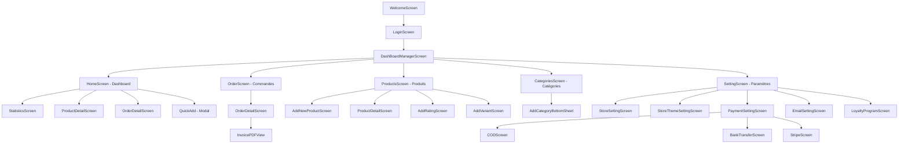
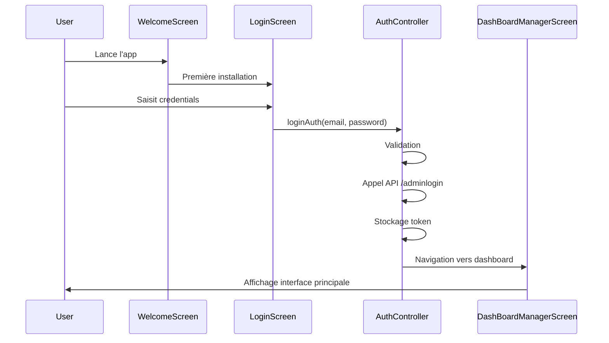
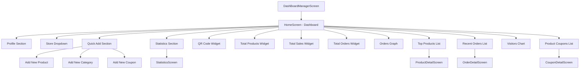
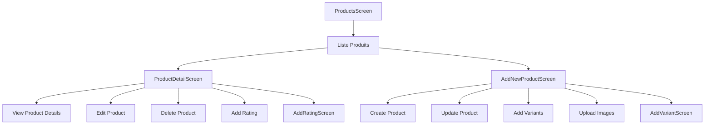
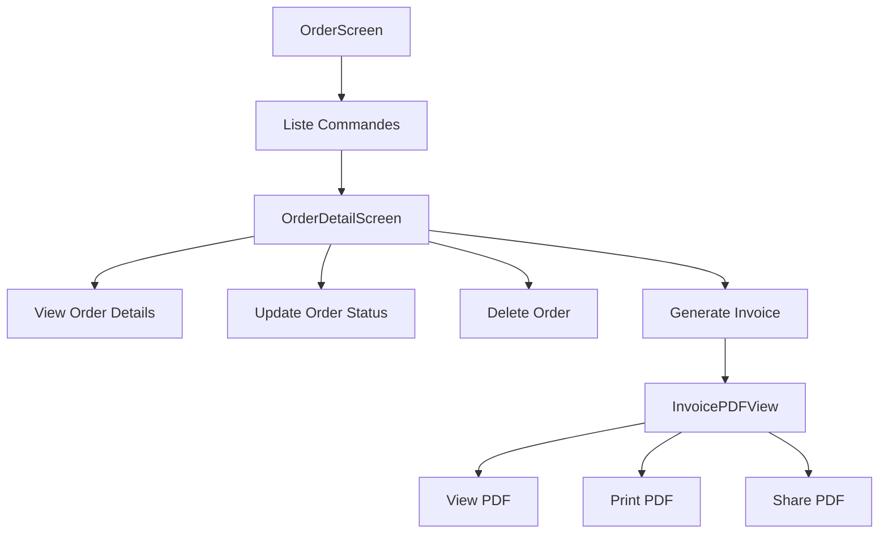
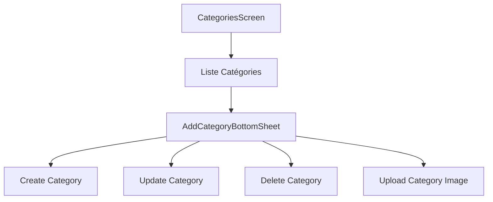
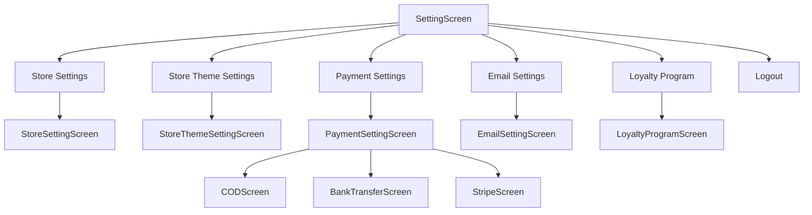

# Navigation et Flux Utilisateur - Moteki Seller App

## Vue d'ensemble

L'application Moteki Seller utilise une architecture de navigation basée sur GetX avec une structure de navigation principale à 5 onglets et des écrans secondaires pour les fonctionnalités détaillées.

## Architecture de Navigation

### Structure Principale

L'application suit cette hiérarchie de navigation :

```
WelcomeScreen (Première installation)
    ↓
LoginScreen (Authentification)
    ↓
DashBoardManagerScreen (Navigation principale - 5 onglets)
    ├── HomeScreen (Dashboard)
    ├── OrderScreen (Commandes)
    ├── ProductsScreen (Produits)
    ├── CategoriesScreen (Catégories)
    └── SettingScreen (Paramètres)
```

## Diagramme de Navigation Principal



## Navigation Bottom Tab

### Structure des Onglets

L'application utilise une navigation bottom custom avec 5 onglets :

```dart
class DashboardManagerController extends GetxController {
  RxInt currantIndex = 2.obs; // Dashboard par défaut
  RxList naviBarItemList = [
    {'icon': ordersIcon, 'title': 'Orders', 'screen': OrderScreen()},
    {'icon': productsIcon, 'title': 'Products', 'screen': ProductsScreen()},
    {'icon': dashboardIcon, 'title': 'Dashboard', 'screen': HomeScreen()},
    {'icon': categoriesIcon, 'title': 'Categories', 'screen': CategoriesScreen()},
    {'icon': settingsIcon, 'title': 'Settings', 'screen': SettingScreen()},
  ].obs;
}
```

### Index de Navigation

- **Index 0** : Orders (Commandes)
- **Index 1** : Products (Produits)
- **Index 2** : Dashboard (Tableau de bord) - **Par défaut**
- **Index 3** : Categories (Catégories)
- **Index 4** : Settings (Paramètres)

## Flux de Navigation Détaillé

### 1. Flux d'Authentification



### 2. Flux Dashboard Principal



### 3. Flux Gestion Produits



### 4. Flux Gestion Commandes



### 5. Flux Gestion Catégories



### 6. Flux Paramètres



## Navigation GetX

### Méthodes de Navigation

```dart
// Navigation simple
Get.to(() => ProductDetailScreen(productId: "123"));

// Navigation avec remplacement
Get.off(() => HomeScreen());

// Navigation avec suppression de l'historique
Get.offAll(() => LoginScreen());

// Retour
Get.back();

// Navigation avec paramètres
Get.toNamed('/product-detail', arguments: {'productId': '123'});
```

### Gestion des Paramètres

```dart
// Passage de paramètres
Get.to(() => ProductDetailScreen(
  productId: product.id.toString(),
  categoryId: product.categoryId.toString(),
));

// Récupération des paramètres
class ProductDetailScreen extends StatelessWidget {
  final String productId;
  final String categoryId;
  
  ProductDetailScreen({
    required this.productId,
    required this.categoryId,
  });
}
```

## Navigation Conditionnelle

### Authentification

```dart
// Vérification du token
String accessToken = await Prefs.getToken();
if (accessToken.isNotEmpty) {
  return DashBoardManagerScreen();
} else {
  return NormalLoginWidget();
}
```

### Mode Démo

```dart
// Vérification du mode démo
if (Prefs.getBool(AppConstant.isDemoMode) == true) {
  commonToast(AppConstant.demoString);
  return;
}
```

## Navigation avec Bottom Sheets

### Modal Bottom Sheets

```dart
// Ajout de catégorie
showModalBottomSheet(
  context: context,
  backgroundColor: AppColor.cBackGround,
  barrierColor: AppColor.cGreyOpacity,
  isScrollControlled: true,
  shape: RoundedRectangleBorder(
    borderRadius: BorderRadius.only(
      topLeft: Radius.circular(30),
      topRight: Radius.circular(30),
    ),
  ),
  builder: (context) {
    return AddNewCategoriesWidget(isUpdate: false);
  },
);
```

### Bottom Sheets Disponibles

- `AddNewCategoriesWidget` - Ajout/Modification catégorie
- `AddNewCouponWidget` - Ajout/Modification coupon
- `AddShippingBottomSheet` - Ajout option livraison
- `AddTaxBottomSheet` - Ajout taxe

## Navigation avec AppBar

### AppBar Standard

```dart
AppBar simpleAppBar({
  required bool isBack,
  required String title,
  String? date,
}) {
  return AppBar(
    backgroundColor: AppColor.cBackGround,
    elevation: 0,
    leading: isBack 
      ? IconButton(
          icon: Icon(Icons.arrow_back, color: AppColor.cLabel),
          onPressed: () => Get.back(),
        )
      : null,
    title: Text(title, style: pRegular20),
    actions: date != null ? [
      Text(date, style: pRegular12),
      SizedBox(width: 16),
    ] : null,
  );
}
```

### AppBar avec Actions

```dart
AppBar appBarWithActions({
  required String title,
  required List<Widget> actions,
}) {
  return AppBar(
    backgroundColor: AppColor.cBackGround,
    title: Text(title),
    actions: actions,
  );
}
```

## Gestion des États de Navigation

### États de Chargement

```dart
// État de chargement global
Obx(() => homeController.isDataAvailable.value 
  ? LoadingWidget() 
  : MainContent()
)
```

### États d'Erreur

```dart
// Gestion des erreurs de navigation
try {
  await Get.to(() => ProductDetailScreen());
} catch (e) {
  commonToast("Navigation error: ${e.toString()}");
}
```

## Navigation avec Deep Links

### Configuration Deep Links

```dart
// Android - android/app/src/main/AndroidManifest.xml
<intent-filter android:autoVerify="true">
  <action android:name="android.intent.action.VIEW" />
  <category android:name="android.intent.category.DEFAULT" />
  <category android:name="android.intent.category.BROWSABLE" />
  <data android:scheme="https" android:host="moteki.app" />
</intent-filter>

// iOS - ios/Runner/Info.plist
<key>CFBundleURLTypes</key>
<array>
  <dict>
    <key>CFBundleURLName</key>
    <string>moteki.app</string>
    <key>CFBundleURLSchemes</key>
    <array>
      <string>https</string>
    </array>
  </dict>
</array>
```

### Gestion des Deep Links

```dart
// Gestion des liens profonds
void handleDeepLink(String link) {
  if (link.contains('/product/')) {
    String productId = link.split('/product/')[1];
    Get.to(() => ProductDetailScreen(productId: productId));
  } else if (link.contains('/order/')) {
    String orderId = link.split('/order/')[1];
    Get.to(() => OrderDetailScreen(orderId: orderId));
  }
}
```

## Navigation avec Animations

### Transitions Personnalisées

```dart
// Transition personnalisée
Get.to(
  () => ProductDetailScreen(),
  transition: Transition.fadeIn,
  duration: Duration(milliseconds: 300),
  curve: Curves.easeInOut,
);
```

### Types de Transitions Disponibles

- `Transition.fadeIn` - Fondu d'entrée
- `Transition.slideInRight` - Glissement depuis la droite
- `Transition.slideInLeft` - Glissement depuis la gauche
- `Transition.slideInUp` - Glissement depuis le bas
- `Transition.zoom` - Zoom
- `Transition.cupertino` - Style iOS

## Navigation avec Guards

### Guards d'Authentification

```dart
// Middleware d'authentification
class AuthMiddleware extends GetMiddleware {
  @override
  RouteSettings? redirect(String? route) {
    String token = Prefs.getToken();
    if (token.isEmpty) {
      return RouteSettings(name: '/login');
    }
    return null;
  }
}
```

### Guards de Permissions

```dart
// Middleware de permissions
class PermissionMiddleware extends GetMiddleware {
  @override
  RouteSettings? redirect(String? route) {
    if (route == '/admin' && !isAdmin()) {
      return RouteSettings(name: '/dashboard');
    }
    return null;
  }
}
```

## Navigation avec Historique

### Gestion de l'Historique

```dart
// Sauvegarde de l'état de navigation
class NavigationController extends GetxController {
  RxList<String> navigationHistory = <String>[].obs;
  
  void addToHistory(String route) {
    navigationHistory.add(route);
  }
  
  void goBack() {
    if (navigationHistory.isNotEmpty) {
      navigationHistory.removeLast();
      Get.back();
    }
  }
}
```

### Navigation avec Historique Personnalisé

```dart
// Navigation avec historique
void navigateWithHistory(String route) {
  navigationController.addToHistory(route);
  Get.toNamed(route);
}
```

## Performance de Navigation

### Optimisations

```dart
// Lazy loading des écrans
class LazyScreen extends StatelessWidget {
  final Widget Function() builder;
  
  LazyScreen({required this.builder});
  
  @override
  Widget build(BuildContext context) {
    return FutureBuilder(
      future: Future.delayed(Duration.zero),
      builder: (context, snapshot) {
        return builder();
      },
    );
  }
}
```

### Préchargement des Écrans

```dart
// Préchargement des écrans fréquents
class ScreenPreloader {
  static void preloadScreens() {
    // Précharger les écrans principaux
    Get.lazyPut(() => ProductController());
    Get.lazyPut(() => OrderController());
    Get.lazyPut(() => CategoryController());
  }
}
```

---

Cette documentation couvre tous les aspects de la navigation dans l'application Moteki Seller. Pour plus de détails sur l'implémentation, consultez les fichiers source dans `lib/view/screen/` et `lib/core/controller/`.
