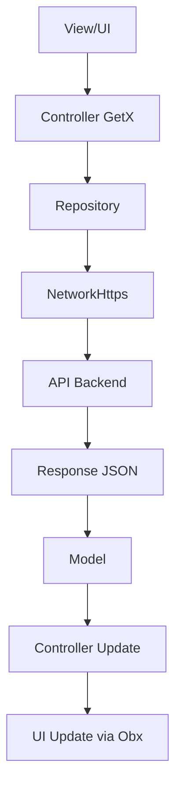
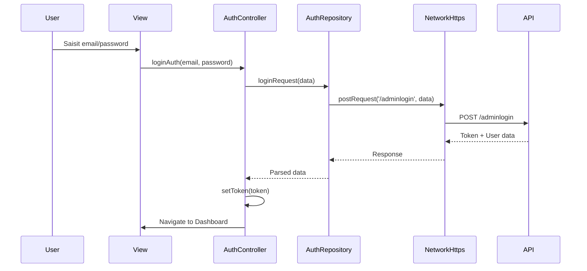
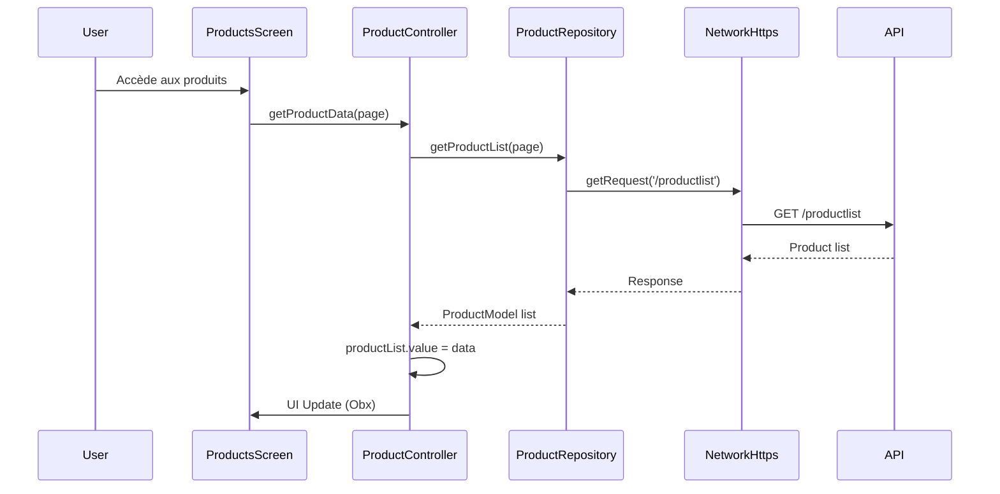

# Architecture de l'Application Moteki Seller

## Vue d'ensemble

**Moteki Seller App** est une application Flutter de gestion e-commerce pour vendeurs utilisant l'architecture MVC avec GetX pour la gestion d'état réactive.

### Technologies Utilisées

- **Framework**: Flutter 3.0.6+
- **Gestion d'état**: GetX (Get)
- **Stockage local**: GetStorage
- **Réseau**: HTTP (package http)
- **Backend**: API REST avec authentification Bearer Token
- **Firebase**: Remote Config, Analytics, Crashlytics
- **UI**: Material Design avec thème personnalisé

## Structure de l'Architecture MVC-GetX

```
lib/
├── core/
│   ├── controller/           # Controllers GetX (logique métier)
│   │   ├── auth/            # Authentification
│   │   ├── dashboard_manager_controller/  # Navigation principale
│   │   ├── home_controller/ # Dashboard et statistiques
│   │   ├── product_controller/ # Gestion produits
│   │   ├── order_controller/  # Gestion commandes
│   │   ├── profile_controller/ # Profil utilisateur
│   │   └── setting_controller/ # Paramètres
│   └── model/               # Modèles de données
│       ├── dashboard_model.dart
│       ├── product_model.dart
│       ├── order_model.dart
│       ├── categories_model.dart
│       └── ...
├── config/
│   └── repository/           # Couche d'accès aux données (API calls)
│       ├── dashboard_repository.dart
│       ├── product_repository.dart
│       ├── order_repository.dart
│       └── ...
├── view/
│   ├── screen/              # Écrans UI
│   │   ├── auth/           # Authentification
│   │   ├── dashboard_manager/ # Navigation principale
│   │   ├── home_screen/     # Dashboard
│   │   ├── product_screen/  # Gestion produits
│   │   ├── order_screen/    # Gestion commandes
│   │   ├── category_screen/ # Gestion catégories
│   │   └── setting_screen/  # Paramètres
│   └── widget/              # Widgets réutilisables
│       ├── common_button.dart
│       ├── common_text_field.dart
│       ├── common_appbar_widget.dart
│       └── custom_bottom_nav_bar/
├── network_dio/              # Couche HTTP
│   └── network_dio.dart     # Gestion requêtes HTTP
├── utils/                    # Utilitaires
│   ├── base_api.dart        # Endpoints API
│   ├── colors.dart          # Palette couleurs
│   ├── constant.dart        # Constantes
│   ├── helper.dart          # Fonctions utilitaires
│   ├── images.dart          # Assets images
│   ├── prefer.dart          # Stockage local
│   ├── text_style.dart      # Styles typographie
│   └── validator.dart        # Validation
├── main.dart                 # Point d'entrée
└── store_go.dart            # Application principale
```

## Flux de Données

### 1. Flux Principal (View → Controller → Repository → API)



### 2. Flux d'Authentification



### 3. Flux de Gestion des Produits



## Architecture des Controllers

### Pattern GetX Controller

Chaque controller suit le pattern suivant :

```dart
class ExampleController extends GetxController {
  // Variables réactives
  RxList<DataModel> dataList = <DataModel>[].obs;
  RxBool isLoading = false.obs;
  RxString errorMessage = ''.obs;
  
  // Repository pour accès aux données
  ExampleRepository repository = ExampleRepository();
  
  // Méthodes de gestion des données
  Future<void> getData() async {
    isLoading.value = true;
    try {
      var response = await repository.getData();
      dataList.value = response;
    } catch (e) {
      errorMessage.value = e.toString();
    } finally {
      isLoading.value = false;
    }
  }
}
```

### Gestion d'État Réactive

- **Obx()** : Widgets qui se mettent à jour automatiquement
- **GetBuilder()** : Widgets avec contrôle manuel des updates
- **RxList, RxBool, RxString** : Variables réactives
- **update()** : Force la mise à jour des GetBuilder

## Couche Réseau

### NetworkHttps Class

```dart
class NetworkHttps {
  // Headers par défaut
  static final Map<String, String> headers = {
    HttpHeaders.contentTypeHeader: 'application/json; charset=utf-8',
    HttpHeaders.cacheControlHeader: "no-cache",
  };
  
  // Méthodes HTTP
  static Future getRequest(String endPoint)
  static Future postRequest(String endPoint, Map data)
  static Future deleteRequest(String endPoint)
}
```

### Gestion des Erreurs

- **401 Unauthorized** : Redirection automatique vers login
- **Timeout** : Gestion des erreurs réseau
- **Validation** : Vérification des réponses API

## Stockage Local

### GetStorage Integration

```dart
class Prefs {
  // Token d'authentification
  static setToken(String token)
  static String getToken()
  
  // Base URL (Firebase Remote Config)
  static setBaseUrl(String baseUrl)
  static String getBaseUrl()
  
  // Store ID
  static setStoreID(String storeId)
  static String getStoreID()
  
  // Mode démo
  static setBool(String key, bool value)
  static bool getBool(String key)
}
```

## Configuration Firebase

### Remote Config

```dart
// Configuration base URL dynamique
final FirebaseRemoteConfig remoteConfig = FirebaseRemoteConfig.instance;
await remoteConfig.fetchAndActivate();
String baseUrl = remoteConfig.getString('base_url');
```

### Analytics & Crashlytics

```dart
// Initialisation Firebase
await Firebase.initializeApp();

// Gestion des erreurs
FlutterError.onError = (errorDetails) {
  FirebaseCrashlytics.instance.recordFlutterFatalError(errorDetails);
};
```

## Navigation

### Structure de Navigation

1. **WelcomeScreen** → Première installation
2. **LoginScreen** → Authentification
3. **DashBoardManagerScreen** → Navigation principale (5 onglets)
   - Orders
   - Products  
   - Dashboard (par défaut)
   - Categories
   - Settings

### Navigation Manager

```dart
class DashboardManagerController extends GetxController {
  RxInt currantIndex = 2.obs; // Dashboard par défaut
  RxList naviBarItemList = [
    {'icon': ordersIcon, 'title': 'Orders', 'screen': OrderScreen()},
    {'icon': productsIcon, 'title': 'Products', 'screen': ProductsScreen()},
    {'icon': dashboardIcon, 'title': 'Dashboard', 'screen': HomeScreen()},
    {'icon': categoriesIcon, 'title': 'Categories', 'screen': CategoriesScreen()},
    {'icon': settingsIcon, 'title': 'Settings', 'screen': SettingScreen()},
  ].obs;
}
```

## Sécurité

### Authentification

- **Bearer Token** : Stockage sécurisé du token
- **Auto-logout** : Redirection automatique sur 401
- **Token refresh** : Gestion de l'expiration

### Mode Démo

```dart
// Configuration mode démo
String isDemoMode = dotenv.get(AppConstant.isDemoMode);
Prefs.setBool(AppConstant.isDemoMode, bool.parse(isDemoMode));

// Blocage des actions en mode démo
if (Prefs.getBool(AppConstant.isDemoMode) == true) {
  commonToast(AppConstant.demoString);
  return;
}
```

## Performance

### Optimisations Implémentées

1. **Lazy Loading** : Pagination infinie pour les listes
2. **Cached Images** : `cached_network_image` pour les images
3. **Reactive Updates** : GetX pour les mises à jour efficaces
4. **Memory Management** : Dispose des controllers

### Points d'Amélioration

1. **Timeout** : Ajouter timeout aux requêtes HTTP
2. **Retry Logic** : Implémenter retry pour les erreurs réseau
3. **Cache** : Cache local pour les requêtes GET fréquentes
4. **Debounce** : Pour les recherches en temps réel

## Tests

### Structure de Tests Recommandée

```
test/
├── unit/
│   ├── models/          # Tests modèles de données
│   ├── controllers/     # Tests controllers GetX
│   ├── repositories/   # Tests couche données
│   └── utils/          # Tests utilitaires
├── widget/             # Tests widgets UI
└── integration/        # Tests end-to-end
```

## Déploiement

### Configuration Environnement

- **Development** : Base URL locale
- **Production** : Base URL Firebase Remote Config
- **Demo Mode** : Mode démo avec données fictives

### Build Configuration

- **Android** : `android/app/build.gradle`
- **iOS** : `ios/Runner/Info.plist`
- **Firebase** : Configuration via `google-services.json` et `GoogleService-Info.plist`

---

Cette architecture suit les meilleures pratiques Flutter avec GetX, offrant une séparation claire des responsabilités et une gestion d'état réactive efficace.
